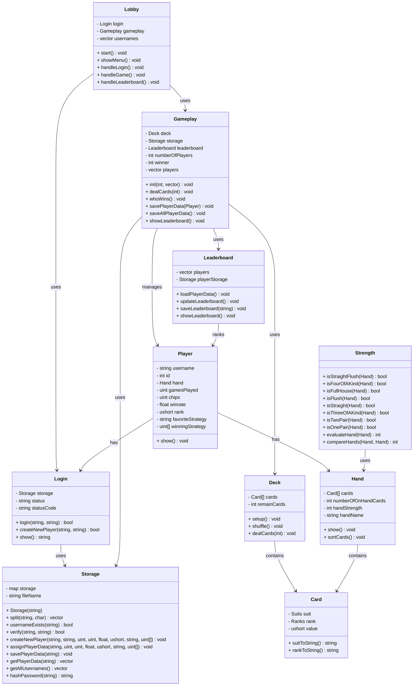

# CSC10012 - Poker Project

## This project uses

- [SDL2](https://www.libsdl.org/) library for graphical user interface.
- [C++](https://cplusplus.com/) programming language for developing the game logic.
- [Makefile](https://medium.com/@ayogun/what-is-makefile-and-make-how-do-we-use-it-3828f2ee8cb) a special file for running all necessary files.

## How to use?

### Some Makefile commands

- `all` &#8594; compiles whole program.
- `run` &#8594; runs the compiled program (should be used after `all`).
- `clean` &#8594; cleans all unnecessary files when done.

<!-- &#8594; is -> -->

### Mac/Linux user

- `make all`
- `make run`
- `make clean`

### Windows user

- `mingw32-make -f Makefile all`
- `mingw32-make -f Makefile run`
- `mingw32-make -f Makefile clean`

---

## Class Diagram

