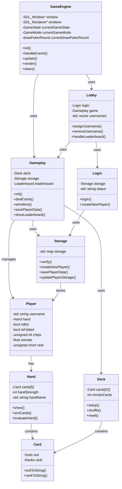

# 🃏 Poker Project

<div align="left" style="display: inline-block; width: 49%;">
    
</div>
<div align="right" style="display: inline-block; width: 49%;">
    
</div>

This is a simple poker game project that we, [@anhtri2407](https://github.com/anhtri2407) and [@haolamnm](https://github.com/haolamnm) developed for our university CSC10012 course - **Fundamentals of Programming**. The game is developed in C++11 and uses the SDL2 library for graphical user interface.

_NOTE: We actually get a perfect score **10/10** for this project._

## Supported Platforms

For now, the game only supports **MacOS** and **Windows**. We have tried our best to make the game run smoothly on both platforms. Since we don't have a **Linux** computer, we can't test the game. If you are using **Linux** and encounter any problems, please let us know.

## Getting Started

### 1. Installation

Since this project is developed in C++11 and uses the SDL2 library, if you are using **Mac** or **Linux**, you need to install the necessary libraries before running the game. The command should be like this:

**Linux**:

```bash
sudo apt-get install libsdl2-dev libsdl2-image-dev libsdl2-ttf-dev libsdl2-mixer-dev
```

**MacOS**:

```bash
brew install sdl2 sdl2_image sdl2_ttf sdl2_mixer
```

_NOTE: You should read the [official documentation](https://wiki.libsdl.org/Installation) for accurate installation, the above command may not work for you._

And if you are using **Windows**, you don't need to install anything because we already included the necessary libraries in the `libs` folder.

### 2. Folk the repository

You can fork the repository by clicking the `Fork` button on the top right corner of the page.

### 3. Clone the repository

If you have forked the repository, you can clone the repository by running the following command:

```bash
git clone https://github.com/haolamnm/poker-game.git
```

If you encounter the error `fatal: early EOF`, it may be due to your network connection or our repository is too large. You can try to clone the repository again using the following command:

```bash
git clone https://github.com/haolamnm/poker-game.git --depth=1
```

If that succeeds, you can download the full history of the repository by running the following command, notice that this is **optional**:

```bash
cd poker-game
git fetch --unshallow
```

### 4. Open the project

Use your favorite IDE to open the project. We recommend using **Visual Studio Code** for the best experience.

### 5. Run the game

#### 5.1. Cleaning

We have already included the `Makefile` to compile and run the game at ease. First, to make sure everything is clean, you can run the following command:

**MacOS**:

```bash
make clean
```

**Windows**:

```bash
mingw32-make -f Makefile clean
```

_NOTE: These commands can be used for cleaning the object files created if you want to recompile the game._

#### 5.2. Compiling

After cleaning, you can compile the game by running the following command:

**MacOS**:

```bash
make all
```

**Windows**:

```bash
mingw32-make -f Makefile all
```

#### 5.3. Running

Finally, you can run the game by running the following command:

**MacOS**:

```bash
make run
```

**Windows**:

```bash
mingw32-make -f Makefile run
```

### How to play

There is a lot of information about how to play poker on the internet. You can read the [Wikipedia](https://en.wikipedia.org/wiki/Poker) page to understand the rules of the game. Or our [poker](poker.pdf) attachment, which has a brief explanation of What is Poker and some basic hand rankings.

After that you can read the [report](report.pdf) attachment, at the section **4. Showcase of the Project** to understand the UI of the game. That section will explain what is the role of each screen and button in the game.

In conclusion, you can play the game by following these steps:
1. Create your own player profile in the **Login Screen**. Just type your username and password, the system will automatically notice you if the username is already taken, otherwise, it will prompt you to create a new player.
2. If you play with your friends, log all of them in, you can see their username in the **Home Screen** at the bottom right corner.
3. You can choose whether to play with your friends (PvP) or with the bot (PvE) in the **Home Screen**. You can head to the **Settings Screen** to change the game mode. There are 2 game modes: **Basic** and **Draw Poker**.
4. After several games, you can check the leaderboard in the **Leaderboard Screen** to see who is the best player in the game.

If that still doesn't help, you can watch the following **YouTube video** to understand how to play the game:

<div align="center">
    <a href="https://youtu.be/SKxSmBQmAmk">
        
    </a>
</div>


## Technical Stack

- **C++11**: The game is developed in C++11, which is a modern version of C++ that has many new features.
- **SDL2**: The game uses the SDL2 library for graphical user interface. We use SDL2 for creating windows, rendering graphics, and handling events.
- **Makefile**: We use the Makefile to make the compiling and running process easier. You can compile and run the game by running a single command.
- **File I/O**: We use the File I/O to store the player data.
- **LaTeX**: We use LaTeX to write the report for the project.

## For Developers

If you are a developer and want to contribute to the project, feel free to create a pull request. We are happy to review your code and merge it into the main branch.

### Contact

Email: [haolamnm.work@gmail.com](mailto:haolamnm.work@gmail.com).

GitHub: [@haolamnm](https://github.com/haolamnm).

LinkedIn: [@haolamnm](https://www.linkedin.com/in/haolamnm/).

### Class Diagram


