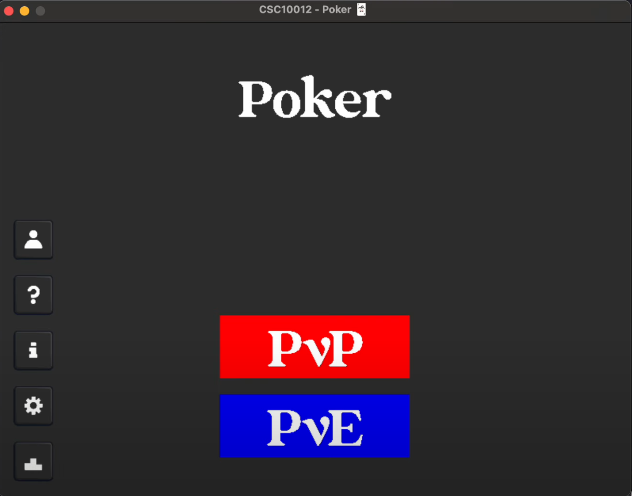
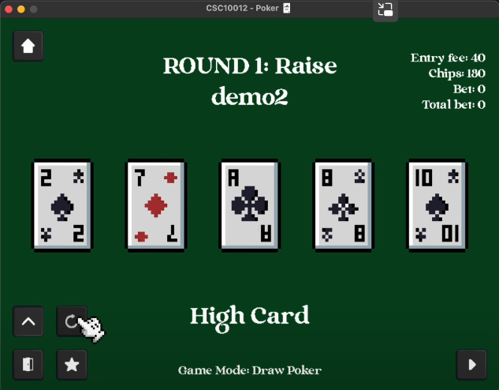
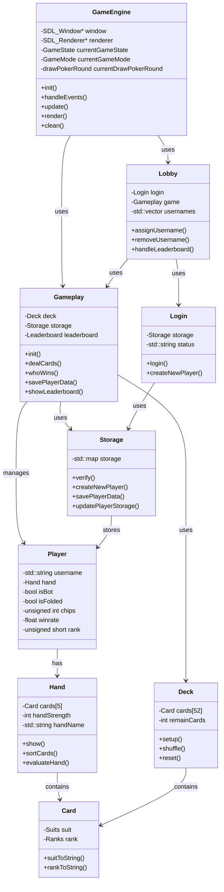

# 🃏 Poker Project

    

    

## Overview

This is a simple poker game project that we, [**@anhtri2407**](https://github.com/anhtri2407) and [**@haolamnm**](https://github.com/haolamnm), developed for our university **[CSC10012] Fundamentals of Programming**. The game is developed in C++11 and uses the SDL2 library for graphical user interface.

> The project earned a perfect score of **10/10**.

## Supported Platforms

+ **MacOS**: Fully tested and supported.
+ **Windows**: Fully tested and supported, with necessary libraries included in the `libs` folder.
+ **Linux**: Untested due to lack of access to a Linux system.

## How to Play

There is a lot of information about how to play poker on the internet. You can read the [**Wikipedia/Poker**](https://en.wikipedia.org/wiki/Poker) page or our [**poker.pdf**](poker.pdf) attachment.

After that you can read [**report.pdf**](report.pdf) attachment, at the section **4. Showcase of the Project** to understand the UI of the game. That section will explain what is the role of each screen and button in the game.

In conclusion, you can play the game by following these steps:
1. Create your own player profile in the **Login Screen**. Just type your username and password, the system will automatically notice you if the username is already taken, otherwise, it will prompt you to create a new player.
2. If you play with your friends, log all of them in, you can see their username in the **Home Screen** at the bottom right corner.
3. You can choose whether to play with your friends (PvP) or with the bot (PvE) in the **Home Screen**. You can head to the **Settings Screen** to change the game mode. There are 2 game modes: **Basic** and **Draw Poker**.
4. After several games, you can check the leaderboard in the **Leaderboard Screen** to see who is the best player in the game.

YouTube Demo: [**https://youtu.be/SKxSmBQmAmk**](https://youtu.be/SKxSmBQmAmk)

## Technical Stack

- **C++11**: The game is developed in C++11.
- **SDL2**: The game uses the [**SDL2**](https://wiki.libsdl.org/SDL3/FrontPage) library for graphical user interface.
- **Makefile**: Make the compiling and running process easier.
- **File I/O**: Store the player data.
- **LaTeX**: Write the report for the project.

## Class Diagram

